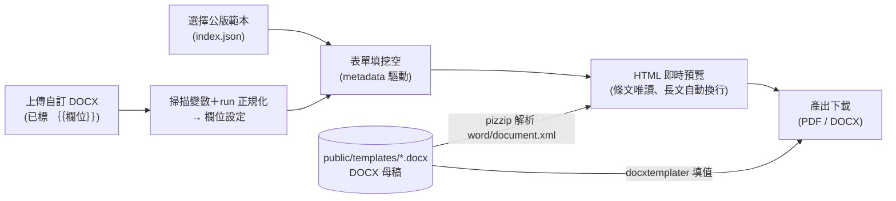

# 公版合約挖空 Demo

驗證合約生命週期（CLM）「套用公版合約範本」能力的純前端技術 Demo：

> **DOCX 母稿 → 使用者只填挖空 → 長文自動換行的即時預覽 → 瀏覽器直接下載 PDF**

- 公版範本是 **DOCX**（不是平面 PDF），挖空以 `{{snake_case}}` 標記撰寫。
- 使用者**只能填挖空**，條文不可編輯。
- 完全靜態（GitHub Pages 可部署）、**不持久化任何資料**：重新整理或離開即清空。

## 架構



- **DOCX 母稿為單一來源**：`scripts/generate-templates.mjs` 以 [`docx`](https://www.npmjs.com/package/docx) 產生三份繁中示範範本（`public/templates/*.docx`）與 metadata（`index.json`）。
- **runtime 解析 DOCX**：前端以 `pizzip` 讀取 `word/document.xml`，取出段落（樣式／對齊／文字）渲染成唯讀預覽，證明條文確實來自 Word 母稿。
- **挖空填值**：表單由 metadata（key、顯示名稱、提示、必填、input 類型）驅動；輸入即時反映於預覽，長文以正常文件流自動換行。
- **PDF**：`html2pdf.js`（html2canvas + jsPDF）對預覽容器光柵化後轉出 A4 PDF，於瀏覽器端直接下載。
- **DOCX（加分項）**：`docxtemplater` 將表單值填回 DOCX 母稿供下載，證明母稿仍是 Word 檔。

## 上傳自訂範本（任意 DOCX）

除了三份預置範本，也可上傳自己的 DOCX：

1. **在 Word 裡標挖空**：於要填寫處輸入 `{{欄位名稱}}`（中文、英數、底線皆可，例：`{{對方公司名稱}}`、`{{effective_date}}`）。同名標記視為同一欄位，填一次全部帶入。
2. **上傳**：系統以 pizzip 解析並做 **run 合併正規化**——Word 常因拼字檢查、輸入法把 `{{標記}}` 拆散成多個 text run，正規化後掃描與填值才抓得到完整標記——再掃出所有變數與出現次數，並回報防呆警告（未閉合的 `{{`、空白標記、頁首頁尾標記不支援等）。
3. **欄位設定**：依名稱自動推斷輸入類型（含「日期／date」→ 日期；含「內容、範圍、說明／desc」→ 多行長文），可逐欄修改顯示名稱、提示、類型與必填。
4. **填寫與下載**：預覽改由 [`docx-preview`](https://www.npmjs.com/package/docx-preview) 渲染（表格、圖片、粗斜體大多可還原），挖空值即時反映；PDF／已填 DOCX 下載機制與預置範本相同。

限制：頁首、頁尾、文字方塊內的標記不支援；檔案上限 10MB；檔案僅在瀏覽器記憶體中處理，不上傳伺服器，離開即清空。

## 三份示範範本

| 範本 | 篇幅 | 挖空欄位 |
|---|---|---|
| 保密合約（NDA） | 短篇 | `counterparty_name`、`counterparty_tax_id`、`effective_date`、`purpose`、`confidential_scope`（長文） |
| 服務合約（摘要版） | 中篇 | `counterparty_name`、`service_desc`（長文）、`fee_amount`、`start_date`、`end_date` |
| 企業標誌使用聲明書 | 短篇 | `declarant_name`、`declaration_body`（長文）、`sign_date` |

每份範本都有至少一個「會長很長」的 textarea 欄位，用來驗證 500+ 字繁中長文在預覽與 PDF 中自動換行、不重疊、不裁切。

## 本機執行

需 Node.js 18+（建議 20）。

```bash
npm install
npm run templates   # 重新產生 public/templates/*.docx 與 index.json
npm run dev         # http://localhost:5173/clm-blank-fill-demo/
npm run build       # 產出 dist/（prebuild 會自動先跑 templates）
```

## 部署到 GitHub Pages

Repo 已含 `.github/workflows/deploy.yml`：

1. Push 到 `main` 分支。
2. GitHub repo → **Settings → Pages → Source 選「GitHub Actions」**（首次需手動設定一次）。
3. Actions 跑完後即可於 `https://<user>.github.io/clm-blank-fill-demo/` 開啟。

若 repo 改名，記得同步修改 `vite.config.ts` 的 `base`。

## 技術取捨與已知限制（誠實聲明）

1. **PDF 是「瀏覽器預覽轉出」，不是 Word 排版引擎的輸出。**
   GitHub Pages 是純靜態環境，無法跑 LibreOffice / OnlyOffice 之類的伺服器端轉檔，
   因此 PDF 的版面 = HTML 預覽的版面，精準度不等於 Microsoft Word。
   正式系統應以伺服器端轉檔取得 Word 級排版。
2. **PDF 內文為光柵化影像（不可選取文字）。**
   採 html2canvas 策略的原因是繁中字型：以系統字型（PingFang TC／微軟正黑體）繪製後轉入 PDF，
   不需在前端嵌入數 MB 的中文字型檔。代價是文字不可選取／搜尋。
   若需可選取文字的 PDF，可改用 jsPDF + 內嵌 Noto Sans TC 子集字型（體積與授權需另行處理）。
3. **html2canvas 對 CJK 有兩個已知 bug，本專案已繞過**：
   `white-space: pre-wrap` 會漏字（改以 `<br>` 呈現使用者換行）；
   inline 元素跨行折行時同行純文字會被丟失（產 PDF 前先把挖空高亮 span 攤平成純文字，
   PDF 也因此是乾淨的簽署版型）。
4. **挖空變數以 metadata（index.json）為準。**
   Demo 的範本由 repo 內腳本產生，metadata 與 DOCX 保證同步；
   正式系統應由後台掃描 DOCX 內的 `{{snake_case}}` 標記自動建立欄位定義。
   另外，挖空標記必須位於同一個 text run 內——實務上管理者在 Word 中編輯後，
   標記可能被 Word 拆散成多個 run，正式系統需先做 run 合併（docxtemplater 生態已有解法）。
5. **不持久化**：所有狀態僅存於 React state，重新整理／離開頁面即清空；
   不使用 localStorage / sessionStorage，符合「每次重來」。
6. **分頁**：PDF 分頁由 html2pdf 依 A4 高度切割，條文標題已設定避免跨頁切斷；
   超長段落跨頁時仍可能在字行邊界切割（光柵策略的固有限制）。

## 非目標

登入／權限／簽核、真的儲存合約、上傳自訂範本、線上改條文、資料庫——皆不在本 Demo 範圍。

---

此為技術 Demo；三份範本內容為示範用途撰寫，非法律文件。
